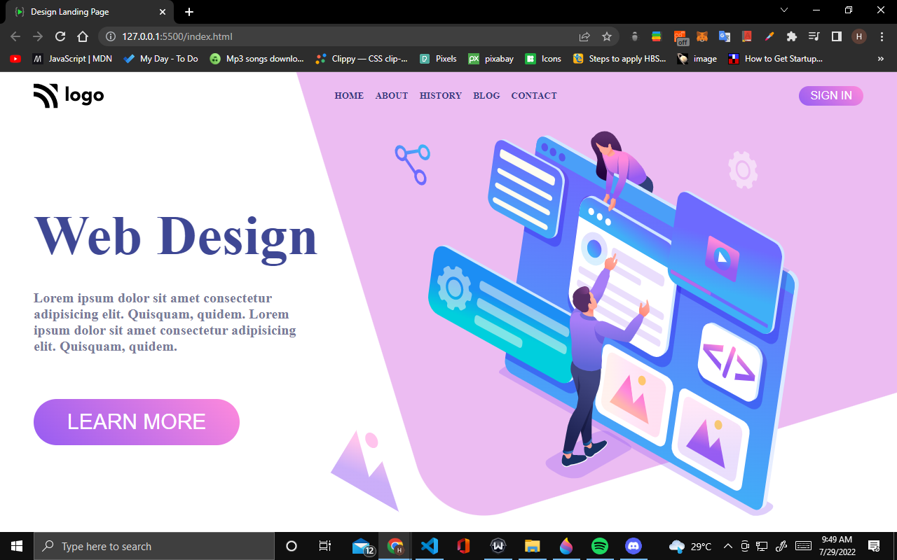

# Project 8 Web Designing Landing Page

## Hey there, I am Hitesh Pal

I have build this website with my core HTML CSS skills

You can check out here: [Web Designing Landing Page By Hitesh](https://food-restaurant-by-hitesh.netlify.app/)

## What i have learned from this project

    - In this project I have learned how to use HTML and css to build templates.
    - How to use flex-box and proper alignment of elements.
    - I also explored and apply pseudo selectors in a div element.

## This project took me around 1 hours approximately.

### Connect with me 
[Twitter](https://twitter.com/HiteshP25522550) 
[Linkdin](https://www.linkedin.com/in/hitesh-pal-8379011ab/)
